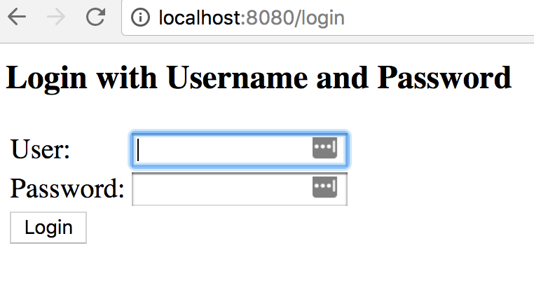

[<< Back To Previous Page](../README.md)

Lab 1.2: Security 
====================================

## Introduction

Spring boot has built in security.


### Step 1: Examine the new code of the pom.xml


We are going to modify the pom.xml in order to add some new components.

Take a look at the following:


```xml
        <dependencies>
                <dependency>
                        <groupId>org.springframework.boot</groupId>
                        <artifactId>spring-boot-starter-security</artifactId>
                </dependency>
                <dependency>
                        <groupId>org.springframework.security</groupId>
                        <artifactId>spring-security-test</artifactId>
                        <scope>test</scope>
                </dependency>
         </dependencies>
```

Notice that there are two new dpendencies, both related to security:

1. spring-boot-starter-security
2. spring-security-test

These are going to introduce security into our applications. The way this will work is that it will force
authentication.

We haven't specified a username or password. In fact, we haven't specified **anything** in our code. So 
how will it work? 

The username will be "user", and the password will be an autogenerated UUID. We will get the password 
once we run the app.

## Step 2: copy the pom.xml to your directory.

```console
cp configs/1.2-pom.xml api-lab-1
```

## Step 3: Re-build


Go to the command line, and type 

```console
cd api-lab-1
./mvnw clean package   # Linux / Mac
```

Windows users should do the following:

```console
cd api-lab-1
mvnw.cmd clean package 
```

Again, we willl see a lot of output.

If things went well, you should see something like this:

```console
[INFO] --- spring-boot-maven-plugin:2.0.2.RELEASE:repackage (default) @ api-lab-1 ---
[INFO] ------------------------------------------------------------------------
[INFO] BUILD SUCCESS
[INFO] ------------------------------------------------------------------------
[INFO] Total time: 11.896 s
[INFO] Finished at: 2018-06-12T22:58:35-07:00
[INFO] ------------------------------------------------------------------------
```

## Step 3: Run my App

Let us now again run our application. We can do that with Maven was well.

```console
./mvn spring-boot:run
```

Followed by a bunch of more messages. This time, watch out for an extremely important message, which is the password.

```console
Using generated security password: 594d8fc9-17e2-4b46-929b-4a9c125305a5
```

Of course, your security password will be different.  Cut and paste the password. Because you will need it in the
next step

## Step 4: Test my app with authentication

Let's test it!  Open your browser to http://localhost:8080

You should get the following response:



You will need to login as **user**, and the password will be the generated password you saw before.

If you correctly authenticate, you will see the following:

```console
Hello from Spring Boot!
```

## Step 5: Use the command line

That is fantastic! But, wait a minute! Do I really have to open a browser up every time I want to authenticate?  That could be a
real pain.

Fortunately, no, you don't have to do that.  Let's test our web service with "curl" -- or your favorite command line tool
for testing web services. You will need to change your password credential to match the one you used in Step 4.

```console
curl -i --user user:594d8fc9-17e2-4b46-929b-4a9c125305a5 http://localhost:8080/
```

If you correctly authenticate, you will see the following:

```console
Hello from Spring Boot!
```


