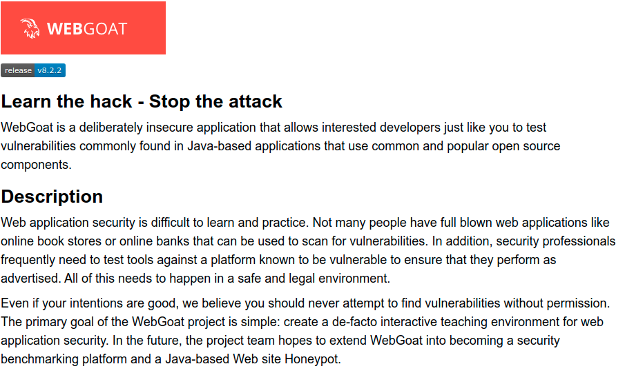
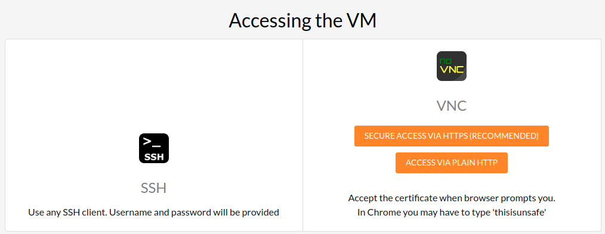

# OWASP Goat labs

* The OWASP projects provides Goat security labs, described [here](https://owasp.org/www-project-webgoat/)

* However, it comes with two warning shown below. Therefore, this is an instruction on running the labs securely.

* __WARNING 1__: While running this program your machine will be extremely vulnerable to attack. You should disconnect from the Internet while using this program. WebGoat’s default configuration binds to localhost to minimize the exposure.

* __WARNING 2:__ This program is for educational purposes only. If you attempt these techniques without authorization, you are very likely to get caught. If you are caught engaging in unauthorized hacking, most companies will fire you. Claiming that you were doing security research will not work as that is the first thing that all hackers claim.

## Instructions on running the labs

### Start the Docker

1. SSH into the VM you are given
2. Enter the following

   `sudo docker run -p 8080:8080 -p 9090:9090 -p 81:8888 -e TZ=Europe/Amsterdam webgoat/goatandwolf:latest`

### Start the goat labs

1. Enter the IP of the VM given to you into the browser

2. Click on SECURE ACCESS VIA HTTPS
3. Enter the password provided to you. You will see the sandbox.
5. Open the browser and enter `localhost:8080/WebGoat`
6. You are ready to go
   
* FYI Goal Labs solutions: https://github.com/WebGoat/WebGoat/wiki/(Almost)-Fully-Documented-Solution-(en)

## Instructor:

* Every student gets this
* ubuntu-clean-desktop-v1
