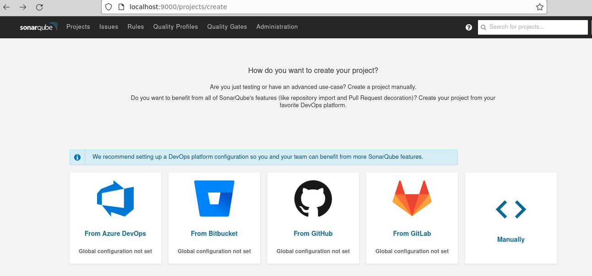
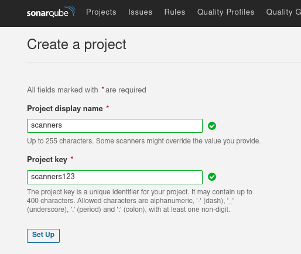
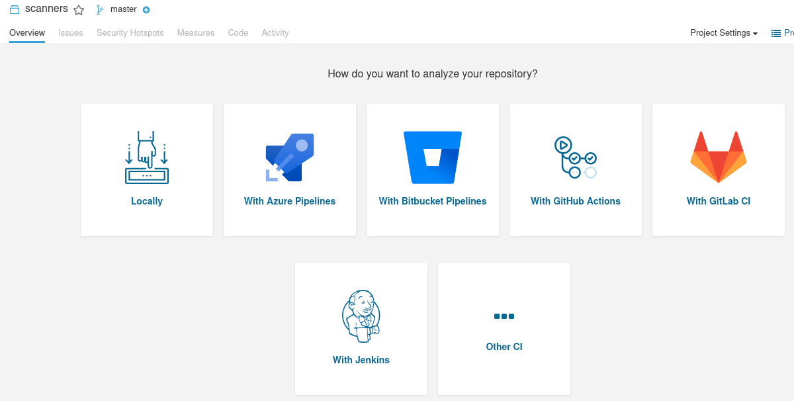
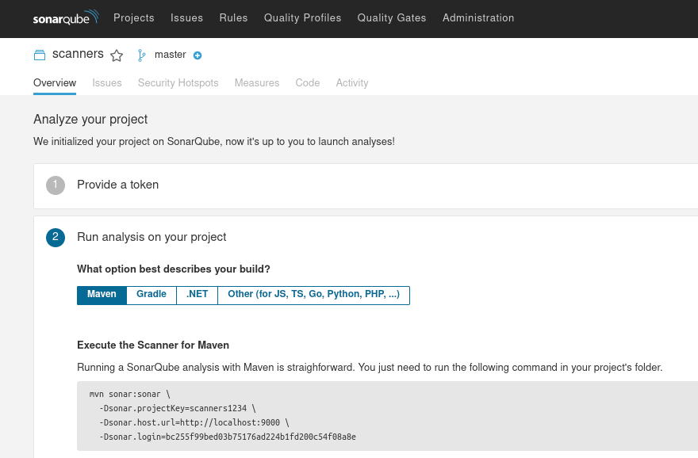
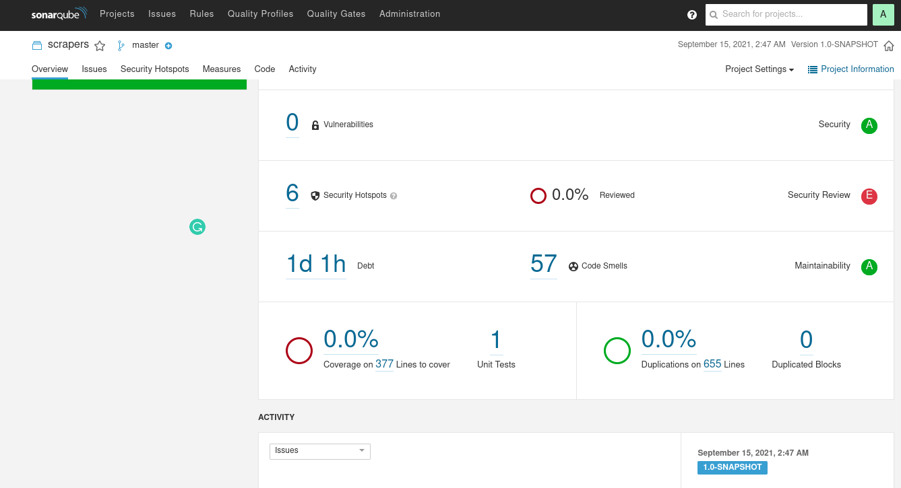

# SonarQube

* This lab teaches how to use SonarQube for static code analysis

### Step 1 - Install and start SonarQube

* (We are following this [link](https://docs.sonarqube.org/latest/setup/get-started-2-minutes/))

  * Start the server by running:
  
  `docker run -d --name sonarqube -e SONAR_ES_BOOTSTRAP_CHECKS_DISABLE=true -p 9000:9000 sonarqube:latest`
*  Once your instance is up and running, Log in to http://localhost:9000 using System Administrator credentials:

`login: admin`

`password: admin`

### Step 2 - Create a project in SonarQube



* Choose "Manually"



* Fill out the names



* Choose "Locally"



* You will run the `mvn start...` instruction, but first you need to download the project to analyze

### Step 3 - Download project to analyze

* On the command line, run this command

`git clone https://github.com/shmsoft/FreeEed`

alternatively, we can use https://github.com/markkerzner/talmudilluminated.git

`git clone https://github.com/markkerzner/talmudilluminated.git`

* Go into the `scrapers` directory

`cd scraper`

* Run the command that you copy/paste from Step 2
* For example

```text
mvn sonar:sonar \
-Dsonar.projectKey=scanners1234 \
-Dsonar.host.url=http://localhost:9000 \
-Dsonar.login=bc255f99bed03b75176ad224b1fd200c54f08a8e
```

* The project will appear in SonarQube
* Enjoy hunting the problems



### Step 4 - Bonus

* Download and analyze your own project

### Congratulations on completing the lab
