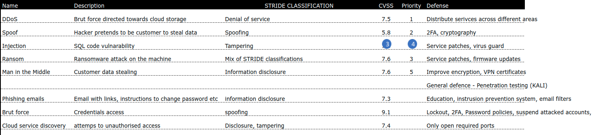
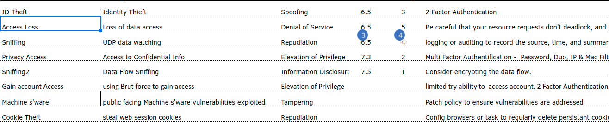

# Threat modeling labs

## Threat list

* The lab is done in the links previously distribute by the instructor.
* Fill out the list of possible attacks, with details
* Use creative thinking and 
* Here are example, draw from them but don't repeat them

